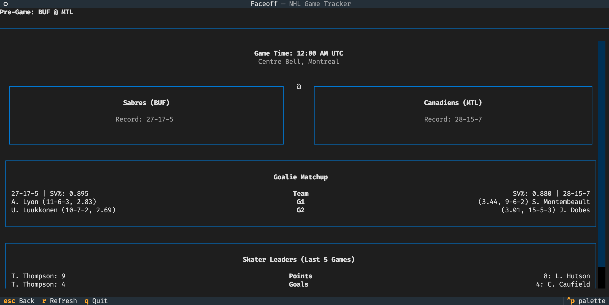

# Faceoff

<p align="center">
  
</p>

A terminal user interface (TUI) application for following NHL hockey games in real-time.


[](https://img.shields.io/github/license/vgreg/faceoff)

## Features

- **Live Game Schedule**: Browse NHL games by date with easy navigation (previous/next day)
- **Real-time Updates**: Auto-refreshing scores for live games
- **Game Details**: View play-by-play, box scores, and scoring summaries for in-progress and completed games
- **Pre-Game Preview**: View matchup data including goalie comparison and skater leaders for upcoming games
- **League Standings**: View current NHL standings with multiple views (Wild Card, Division, Conference, League)
- **Player Stats Leaders**: View top players in various statistical categories for skaters and goalies
- **Team Browser**: Browse all NHL teams, view rosters, and team schedules
- **Player Profiles**: View detailed player information, career stats, and game logs
- **Responsive Layout**: Game cards automatically arrange based on terminal width
- **Local Time Display**: Game times shown in your local timezone with timezone abbreviation

## Installation

### Using uvx (recommended)

```bash
uvx faceoff
```

### Using pip

```bash
pip install faceoff
```

Then run:

```bash
faceoff
```

### From source

```bash
git clone https://github.com/vgreg/faceoff.git
cd faceoff
uv run faceoff
```

## Screenshot



## Acknowledgments

This project was inspired by [Playball](https://github.com/paaatrick/playball), a similar terminal application for following MLB baseball games.

### Built With

- **[Textual](https://github.com/Textualize/textual)** - The modern TUI framework for Python that powers the user interface
- **[nhl-stats-api-client](https://github.com/nhl-stats-api-client)** - Python client for accessing NHL API data

## Disclaimer

This project is not affiliated with, endorsed by, or in any way officially connected with the National Hockey League (NHL), any of its teams, or any of its affiliates. All NHL logos, trademarks, and data are the property of the NHL and its teams.

This application uses publicly available NHL API data for informational and educational purposes only.

## Development

### Setup

```bash
git clone https://github.com/vgreg/faceoff.git
cd faceoff
make install
```

### Running Tests

```bash
uv run pytest
```

### Linting

```bash
uv run ruff check src/
```

## License

This project is licensed under the MIT License - see the [LICENSE](LICENSE) file for details.

## Contributing

Contributions are welcome! Please feel free to submit a Pull Request.
